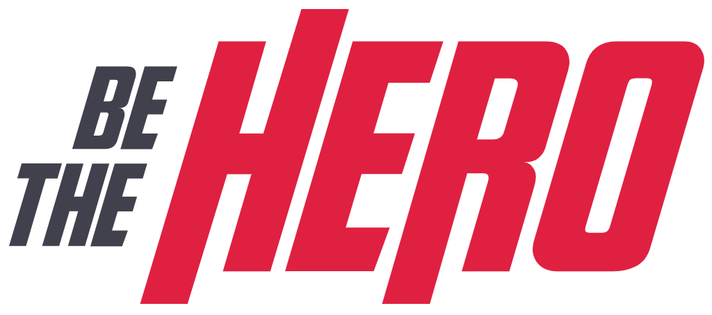
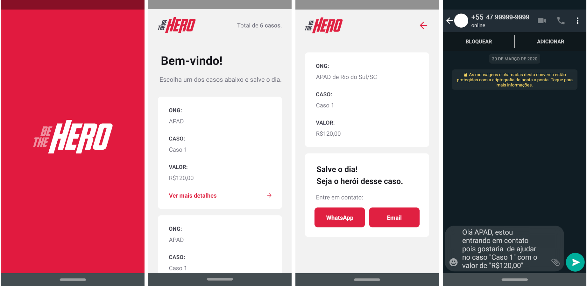

<h1 align="center">
    
    <br>Semana Omnistack 11<br/>
    Node.js | ReactJS | React Native
</h1>

<p align="center">
  
  
  <br/>
</p>
<p align="center">
  <a href="#bookmark-sobre">Sobre</a>&nbsp;&nbsp;&nbsp;|&nbsp;&nbsp;&nbsp;
  <a href="#rocket-tecnologias">Tecnologias</a>&nbsp;&nbsp;&nbsp;|&nbsp;&nbsp;&nbsp;
  <a href="#boom-como-executar">Como Executar</a>&nbsp;&nbsp;&nbsp;|&nbsp;&nbsp;&nbsp;
  <a href="#memo-licença">Licença</a>
</p>

<p align="center">
    
    
    
    
    
</p>


## :bookmark: Sobre

A **Be-The_Hero** é uma aplicação para conectar ONGs e outras instituições a pessoas que tem disponibilidade para ajudar.
O projeto consiste em uma aplicação web e mobile para conectar pessoas dispostas a ajudar a ONGs que precisam dessa ajuda.

Em uma semana foi desenvolvida uma aplicação do zero, dominando o backend, frontend e o mobile com uma única linguagem, **o Javascript**.
    
Este projeto foi desenvolvido durante a **A 11ª edição da Semana OmniStack**, ocorrida entre 23/03 e 27/03/2020, ministrado por Diego Fernandes, CTO da [Rocketseat](https://rocketseat.com.br/).

## :rocket: Tecnologias

-  [Node.js](https://nodejs.org/en/)
-  [ReactJS](https://reactjs.org/)
-  [React Native](http://facebook.github.io/react-native/)
-  [axios](https://github.com/axios/axios)
-  [Expo](https://expo.io/)


## :boom: Como executar

- ### **Pré-requisitos**

  - É **necessário** possuir o **[Node.js](https://nodejs.org/en/)** instalado no computador
  - É **necessário** possuir o **[Git](https://git-scm.com/)** instalado e configurado no computador
  - Também, é **preciso** ter um gerenciador de pacotes seja o **[NPM](https://www.npmjs.com/)** ou **[Yarn](https://yarnpkg.com/)**.
  - Por fim, é **essencial** ter o **[Expo](https://expo.io/)** instalado de forma global na máquina

1. Faça um clone do repositório:

```sh
  $ git clone https://github.com/EdsonCandido73/Be-The_Hero_OS11
```

2. Executando a Aplicação:

```sh
  # API
     $ cd backend

     # Instalar as dependências do projeto.
     $ yarn # ou npm install

     # Iniciar a API
     $ yarn start  (ou npm start)

  # Aplicação web
     $ cd frontend

     # Instalar as dependências do projeto.
     $ yarn  (ou npm install)

     # Iniciar a aplicação web
     $ yarn start  (ou npm start)

  # Aplicação mobile
     $ cd mobile

     # Instalar as dependências do projeto.
     $ yarn  (ou npm install)
     
     # Iniciar a aplicação mobile
     $ yarn start  (ou npm start)
```


## :memo: Licença

Esse projeto está sob a licença MIT. Veja o arquivo [LICENSE](LICENSE) para mais detalhes.

---
<sup>Projeto desenvolvido por [Edson Cândido](https://github.com/EdsonCandido73) com a tutoria de [Diego Fernandes](https://github.com/diego3g), da [Rocketseat](rocketseat.com.br).</sup>